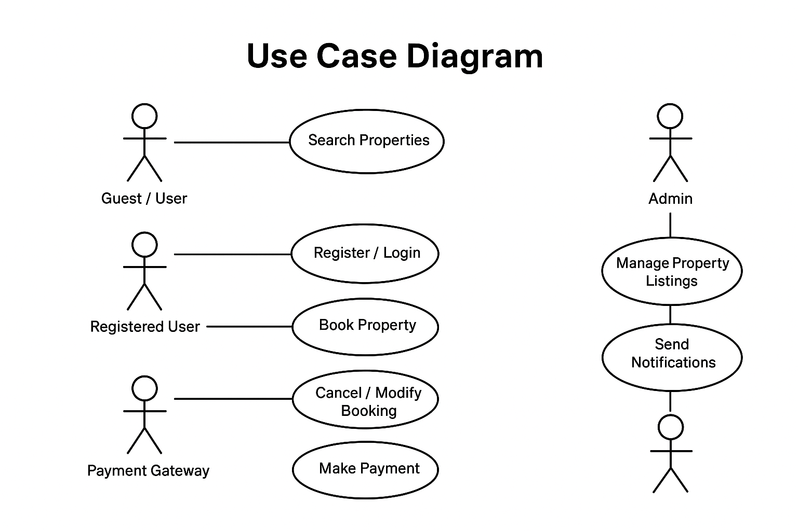

# Requirement Analysis in Software Development

## Introduction
This repository is dedicated to exploring the **Requirement Analysis** phase in the Software Development Lifecycle (SDLC). It provides documentation, examples, and visual representations of key activities such as requirement gathering, elicitation, documentation, analysis, and validation. The goal is to create a clear blueprint for developing a booking management system and to demonstrate industry-standard practices in defining functional and non-functional requirements, use cases, and acceptance criteria.

## What is Requirement Analysis?

Requirement Analysis is a critical phase in the Software Development Lifecycle (SDLC) where the project team gathers, examines, and defines the requirements for a software system. The main goal of this phase is to ensure that all stakeholders—including clients, users, and developers—have a clear and shared understanding of what the system should do and how it should perform.

### Importance of Requirement Analysis

1. **Clarity and Understanding:** It helps reduce misunderstandings by clearly defining what the stakeholders expect from the system.  
2. **Scope Definition:** Establishes the boundaries of the project, helping prevent scope creep.  
3. **Foundation for Design and Development:** Provides a solid basis for creating system designs and writing code.  
4. **Cost and Time Estimation:** Facilitates accurate planning for resources, budget, and project timelines.  
5. **Quality Assurance:** Ensures the final product meets the defined requirements, improving user satisfaction and reducing post-deployment issues.

## Why is Requirement Analysis Important?

Requirement Analysis is a crucial step in the SDLC because it ensures that software development proceeds efficiently and meets user expectations. Here are three key reasons why it is important:

1. **Clear Understanding of Stakeholder Needs:**  
   Requirement Analysis helps the team understand exactly what stakeholders expect from the software. This reduces ambiguity and ensures everyone is aligned on project goals.

2. **Prevents Scope Creep:**  
   By defining the project’s scope early, Requirement Analysis helps avoid unnecessary additions or changes during development, keeping the project on track in terms of time and cost.

3. **Foundation for Design and Development:**  
   Well-documented requirements provide a solid base for creating system designs, writing code, and planning tests, which ultimately leads to higher quality software and satisfied users.

## Key Activities in Requirement Analysis

- **Requirement Gathering**  
  - Collect information from stakeholders to understand their needs and expectations.  
  - Techniques: interviews, surveys, workshops, observation, document review.

- **Requirement Elicitation**  
  - Refine and elaborate on gathered information.  
  - Techniques: brainstorming sessions, focus groups, prototyping.

- **Requirement Documentation**  
  - Record requirements in a structured format.  
  - Tools: requirement specification documents, user stories, use case diagrams.

- **Requirement Analysis and Modeling**  
  - Examine and prioritize requirements based on importance and feasibility.  
  - Tools: data flow diagrams, entity-relationship diagrams, other modeling techniques.

- **Requirement Validation**  
  - Review requirements with stakeholders to ensure accuracy and completeness.  
  - Includes defining acceptance criteria and maintaining traceability.
## Types of Requirements

### Functional Requirements
**Definition:** Functional requirements describe what the system should do. They define the specific features and behaviors of the software.

**Examples for the Booking Management System:**  
- **Search Properties:** Users can search for hotels or rooms based on location, price, and availability.  
- **User Registration & Authentication:** Users can create accounts, log in, and manage profiles securely.  
- **Booking Management:** Users can book rooms, view booking details, and cancel or modify bookings.  
- **Payment Integration:** Users can make payments securely through integrated payment gateways.  
- **Admin Dashboard:** Admins can manage property listings, bookings, and generate reports.  
- **Notifications:** Users receive booking confirmations and reminders via email or SMS.

---

### Non-functional Requirements
**Definition:** Non-functional requirements describe how the system should perform. They cover performance, security, usability, reliability, and scalability.

**Examples for the Booking Management System:**  
- **Performance:** Pages should load within 2 seconds and support up to 1000 concurrent users.  
- **Security:** Data encryption, secure login, and protection against common vulnerabilities.  
- **Scalability:** System should handle growing user traffic and property listings efficiently.  
- **Usability:** Intuitive and user-friendly interface for both customers and admins.  
- **Reliability:** High uptime (e.g., 99.9%) with quick recovery from failures.  
- **Maintainability:** Modular design that allows easy updates and feature additions.  
- **Compliance:** Adhere to data protection regulations (e.g., GDPR).

## Use Case Diagrams

**Definition:**  
Use Case Diagrams visually represent how users (actors) interact with a system to achieve specific goals (use cases). They help show the functionality of a system from the user’s perspective.

**Benefits:**  
- Provide a clear overview of system functionalities.  
- Help identify all the interactions between users and the system.  
- Facilitate communication between stakeholders and the development team.  
- Aid in organizing and prioritizing system requirements.  

**Use Case Diagram for the Booking Management System:**  
The key actors and use cases are:  

**Actors:**  
- Guest / User  
- Registered User  
- Admin  
- Payment Gateway  

**Use Cases:**  
- Search Properties  
- Register / Login  
- Book Property  
- Cancel / Modify Booking  
- Make Payment  
- Manage Property Listings  
- Send Notifications  

**Diagram:**  
You can create the use case diagram using **Draw.io** or any similar diagram tool. Save it as **alx-booking-uc.png** and place it in your repository. Then link it in your README as follows:

